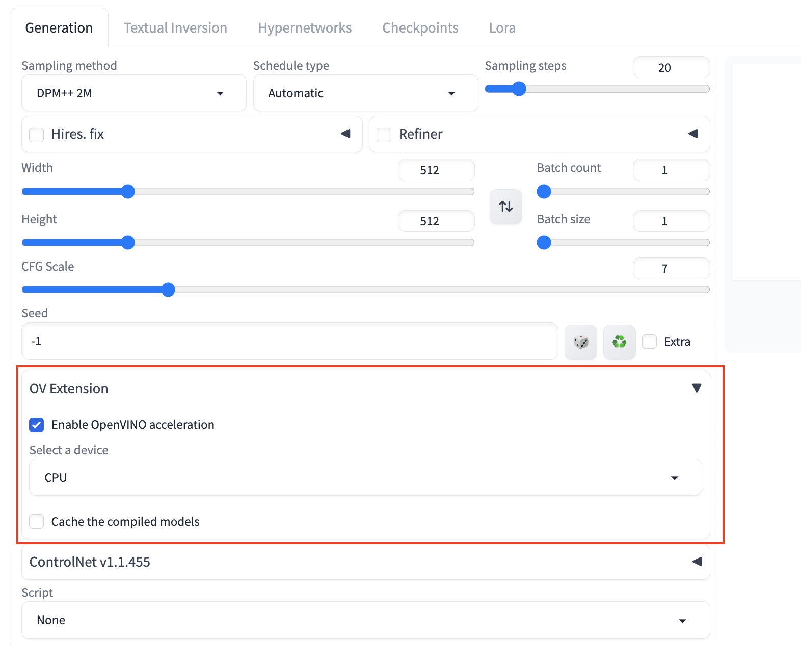
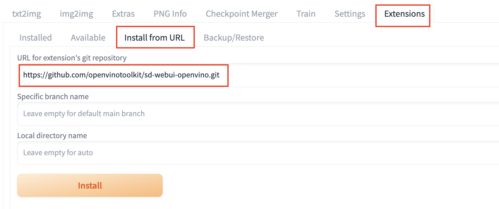
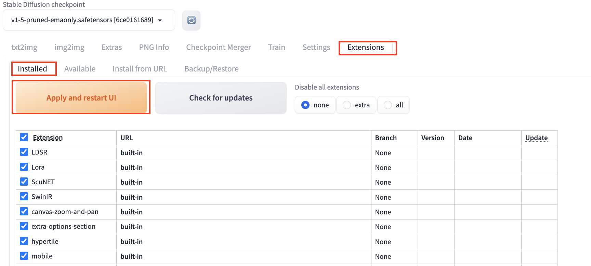

# OpenVINO Extension for Stable Diffusion

This extension accelerate the image generation speed by integrating OpenVINO backend to diffusers.

## Installation
- Open "Extensions" tab.
- Open "Install from URL" tab in the tab.
Enter https://github.com/openvinotoolkit/sd-webui-openvino.git to "URL for extension's git repository".

- Press "Install" button.
- Go to "Installed" tab, then click "Apply and restart UI". 

## Features
- Support txt2img pipeline ,img2img and inpaint pipeline. 
- Support most of the upscalers, fallback to torch for unsupported upscalers.
  - OpenVINO supported model get accelerated automatically(latent, R-esrGAN, etc)
  - OpenVINO yet to support model fallback to native Pytorch
- Support ControlNet 1.0/1.1 throught [ControlNet Extension](https://github.com/Mikubill/sd-webui-controlnet)
- Support Lora

